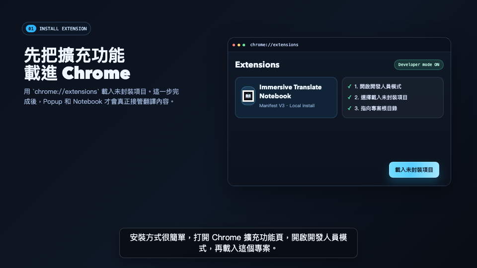

# Immersive Translate Notebook

Chrome Extension（Manifest V3），用來擷取沉浸式翻譯在網頁與影片字幕上的雙語內容，並提供：
- Popup 快速檢索 / 收藏 / 匯出
- 獨立分頁 Notebook（收藏清單 + AI 深度解析）

## Demo Video

[](./tutorial-video/out/immersive-translate-tutorial.mp4)

GitHub README 不支援直接內嵌播放 `<video>`，請點擊上方預覽圖或下方連結到 GitHub 檔案頁觀看影片：

[觀看 Demo Video](./tutorial-video/out/immersive-translate-tutorial.mp4)

---

## 功能總覽

### 1) 自動擷取雙語內容
- 網頁翻譯：透過 `.immersive-translate-target-wrapper` 擷取原文與譯文。
- 影片字幕：支援一般字幕容器與 Shadow DOM 字幕視窗（例如 YouTube 類場景）。
- 即時監聽：`MutationObserver` + 防抖，持續收集新字幕/新翻譯。

### 2) Popup（快速操作）
- 即時列表：顯示所有已收集翻譯對。
- 搜尋與過濾：關鍵字、來源、類型（網頁/影片/收藏）。
- 一鍵收藏：加入或移除 Notebook。
- 一鍵複製：複製原文或譯文。
- 匯出 / 清除：匯出 JSON、清空資料。
- 進場動畫：新字幕進來時卡片會有緩和進場動畫。

### 3) Notebook（獨立頁）
- 僅顯示收藏項目（`isFavorite = true`）。
- 大畫面閱讀模式，適合複習與長時間整理。
- AI 深度文法解析（彈窗）：
  - 支援 Google Gemini / OpenAI
  - 驗證 API Key 後自動拉取模型清單
  - 可指定輸出語言（繁中 / 簡中 / English / 日本語 / 한국어）

---

## 專案結構

```text
immersivetranslateNotebook/
├── manifest.json       # Extension 設定（MV3）
├── content.js          # 內容擷取：網頁翻譯 + 影片字幕 + Shadow DOM 監聽
├── background.js       # Service Worker：儲存、查詢、收藏切換、匯出
├── popup.html
├── popup.css
├── popup.js            # Popup 互動（搜尋/過濾/收藏/複製/匯出）
├── notebook.html
├── notebook.css
├── notebook.js         # Notebook 互動（收藏清單 + AI 設定/呼叫）
└── icons/
```

---

## 安裝方式

1. 打開 Chrome，進入 `chrome://extensions/`
2. 開啟「開發人員模式」
3. 點擊「載入未封裝項目」
4. 選擇本專案資料夾
5. 安裝完成後可在工具列點開 Popup

---

## 如何打包 Release

如果要打包成 ZIP 檔進行發布，可以使用以下指令（已自動排除開發用資料夾與 Git 檔案）：

```bash
zip -r immersivetranslate-notebook.zip . -x "*.git*" -x "*.DS_Store*" -x "tutorial-video/*" -x ".gitignore" -x ".gitattributes" -x "immersivetranslate-notebook.zip"
```

打包完成後，將 `immersivetranslate-notebook.zip` 進行發布即可。

---

## 使用流程

1. 先安裝並啟用 [Immersive Translate](https://immersivetranslate.com/)
2. 開啟任意網頁或影片，讓沉浸式翻譯開始工作
3. 本擴充會自動收集翻譯對
4. 在 Popup 中可：
   - 搜尋 / 來源過濾 / 類型過濾
   - 收藏重要句子（⭐）
   - 複製原文或譯文
   - 匯出 JSON
5. 點「獨立筆記本」進入 `notebook.html`：
   - 集中看收藏
   - 設定 AI 金鑰與模型
   - 對單句做 AI 深度解析

---

## 儲存資料格式

儲存在 `chrome.storage.local`（key: `it_notebook_pairs`），每筆資料類似：

```json
{
  "original": "The quick brown fox jumps over the lazy dog.",
  "translation": "那隻敏捷的棕色狐狸跳過了那隻懶狗。",
  "url": "https://example.com/article",
  "title": "Example Article Title",
  "timestamp": "2026-04-12T09:30:00.000Z",
  "type": "web",
  "isFavorite": true
}
```

欄位補充：
- `type`: `web` 或 `video`
- `isFavorite`: 是否加入 Notebook 收藏

---

## 訊息介面（runtime message）

由 `popup/notebook/content` 與 `background` 溝通：
- `SAVE_PAIRS`
- `GET_PAIRS`
- `CLEAR_PAIRS`
- `EXPORT_JSON`
- `TOGGLE_FAVORITE`
- `MANUAL_EXTRACT`（content script 端）

---

## 隱私與安全

- 所有資料預設只存瀏覽器本地（`chrome.storage.local`）。
- AI API Key 只儲存在本機 extension storage。
- 呼叫 AI 解析時，僅會送出你選定句子（原文/譯文）與提示詞內容到所選供應商 API。

---

## 開發備註

- 此專案為原生 JS/HTML/CSS，無 bundler。
- 直接修改檔案後，到 `chrome://extensions/` 重新整理 extension 即可測試。
- 快速語法檢查：

```bash
node --check popup.js
node --check notebook.js
node --check content.js
node --check background.js
```
